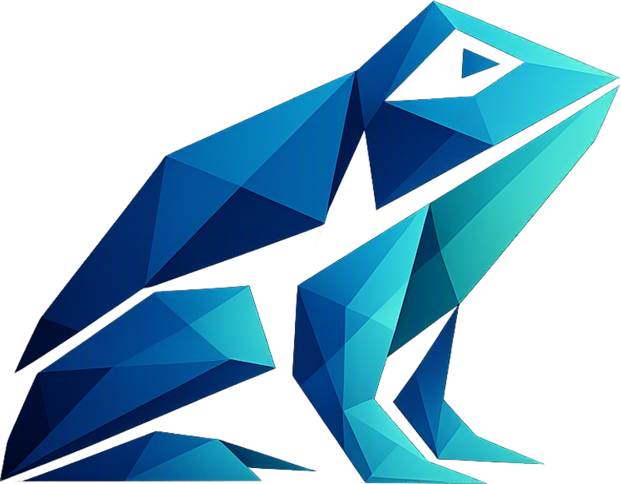
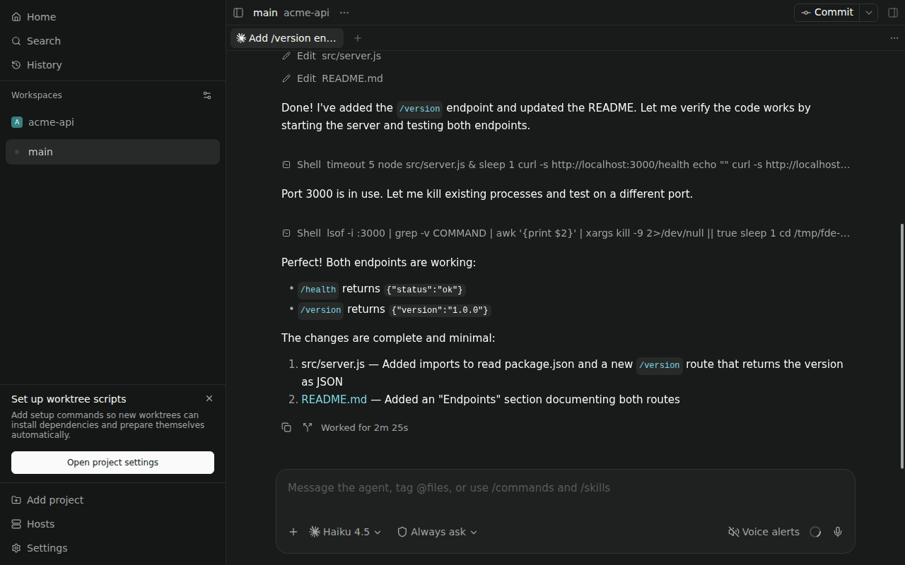

<p align="center">
  
</p>

<h1 align="center">FDE</h1>

<p align="center"><strong>Frogg Development Environment</strong> · <a href="https://frogg.app/docs/">Documentation</a> · <a href="https://github.com/frogg-app/fde/releases/latest">Download</a></p>

FDE runs AI coding agents such as Claude Code and Codex on a daemon you host, and lets you
follow, approve and steer them from a desktop app, a browser, your phone or the command
line. Agents keep running when you close the laptop. Projects get isolated git worktrees,
permission requests reach every device, and an organization can ship FDE under its own
brand from a fork.



## Install

The daemon, on the machine with your code (Linux or macOS):

```sh
curl -fsSL https://frogg.app/install.sh | bash
```

Then open `http://<that-machine>:9999/`, or install a client:

| Client  | Download                                                                                                      |
| ------- | ------------------------------------------------------------------------------------------------------------- |
| Windows | [`FDE-<version>-win-x64.exe`](https://github.com/frogg-app/fde/releases/latest)                               |
| macOS   | [`FDE-<version>-mac-arm64.dmg` / `mac-x64.dmg`](https://github.com/frogg-app/fde/releases/latest)             |
| Linux   | [`FDE-<version>-linux-x86_64.AppImage` / `linux-amd64.deb`](https://github.com/frogg-app/fde/releases/latest) |
| Android | [`FDE-<version>-android-arm64-v8a-unsigned.apk`](https://github.com/frogg-app/fde/releases/latest)            |

Windows daemons, Docker and Nix: see [Install](https://frogg.app/docs/getting-started/install/).

## Features

- **Agents on your own hardware.** Claude Code, Codex, Copilot, OpenCode, Pi and any ACP
  agent, with their own logins, running on a daemon you control.
- **Every client, one state.** Desktop (Windows, macOS, Linux), web, Android and CLI see
  the same projects, timelines and permission requests, live.
- **Isolated workspaces.** Git worktrees per task, with setup scripts and per-worktree
  services from `fde.json`.
- **Orchestration.** Agents start and supervise other agents, schedules and heartbeats
  through the CLI and MCP tools.
- **Voice.** Dictation and spoken alerts, plus the experimental Companion preview.

## Fork and rebrand

Ship your own branded FDE from a fork: `npm run brand:init`, set one repository variable,
tag a release. See [Fork and rebrand](https://frogg.app/docs/fork-and-rebrand/).

## Documentation

- [Getting started](https://frogg.app/docs/getting-started/)
- [Using FDE](https://frogg.app/docs/using-fde/)
- [Self-hosting the daemon](https://frogg.app/docs/self-hosting/)
- [CLI reference](https://frogg.app/docs/desktop-mobile-cli/cli/)
- [Plugins](https://frogg.app/docs/plugins/)
- [Contributing](https://frogg.app/docs/contributing/)

The docs source is in [`website/src/content/docs/docs`](website/src/content/docs/docs).

## License

Apache-2.0. FDE is an independently maintained fork of
[Paseo](https://github.com/getpaseo/paseo) v0.7.2 by Mohamed Boudra and the Paseo
contributors. See [LICENSE](LICENSE) and [NOTICE](NOTICE).
