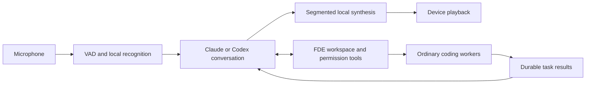

# Companion

Companion lets you have a voice conversation while Claude and Codex workers do
project work on your daemon. It is optional and **disabled by default on each
device**. Turn on **Settings → General → Enable Companion**, then choose
the bottom-right **Companion** launcher in a project composer. It replaces the
former Voice mode action and works while a coding worker is busy. Companion no
longer appears in the sidebar. Enabling it does not start a model or acquire the microphone.
Existing installations also default to off; the former auto-start preference is
no longer used.

Implementation and qualification record: **2026-09-12**. Subscription text and
native WebRTC delegation have been exercised on Linux. Physical mobile and other
host-platform acceptance remains open. See [validation](companion-validation.md).
Standalone Android and Linux daemon artifacts and deployment commands are in
[test builds](companion-test-builds.md).

## Conversation controls

- **Mute** pauses microphone input while tasks continue.
- **End** releases audio and closes the conversation. It stays stopped until an
  explicit Start action. Ending a conversation does not cancel coding tasks.
- **Minimize** keeps the conversation active, with a persistent Open/End control.
- Dismissing the panel, including its close button or sheet gesture, minimizes
  it and keeps capture, playback and task announcements active. Only **End**,
  disabling Companion, or an audio interruption ends the conversation.
- Disabling Companion hides its launcher, command search and keyboard entry
  points; Settings remains.
- Say that you want to end the conversation to invoke `end_conversation`. Ask to
  cancel a particular task to invoke `cancel_agent` instead.

One conversation may be active per daemon. Capture and playback have exclusive
ownership on the device across Companion, dictation, agent voice and alerts.
Starting a second capture mode requires ending the current one.

Settings distinguish disabled, setup required, ready, connecting, active and
failed states. They show the selected conversation model and its billing mode,
link to provider setup, and point to host Usage for provider-supplied limits.
“No API key” does not mean unlimited subscription usage. FDE does not estimate
missing quota data as an unlimited allowance.

## Context and conversation preferences

The composer launcher captures its host, workspace and agent. The panel and
minimized indicator show the host and project; reopening from another project
preserves the active conversation's original context. If the selected worker is
already running, Companion tracks that task and its permission/result events
without restarting it. New work on that same selected worker is tracked while
the conversation remains active, including when minimized. End first to launch on a
different host. You can explicitly choose another workspace by voice on that host.

Settings → General → Companion offers preferences for the next conversation:

- Reply length: **Brief** (default) or Detailed.
- Spoken task updates: **Completions and failures** (default), Completions only,
  or Off. Permission requests remain audible. Muting the microphone does not
  mute results. Updates turned off remain available in task receipts.
- Acknowledge tasks before working: **off** by default. Quiet local speech drops
  tool preambles and successful dispatch acknowledgements; a failed dispatch
  still gets an explanation. Tool execution and completion are separate events.
- Pause before replying: 0.8, **1.4**, or 2.4 seconds of detected silence.
- Let me interrupt by speaking: **on** by default.

Pause and interruption settings apply to local speech. Native WebRTC uses its
provider's turn detection. Briefness and acknowledgement preferences also enter
its conversation instructions. Preferences are captured at explicit Start and
preserved across reconnect; changing Settings does not reconfigure an active call.

Local voice runs VAD, recognition and synthesis in separate child processes.
Microphone delivery never awaits the model reply or playback. During speech,
Parakeet publishes revised partial transcripts at a throttled interval, retaining
completed portions of long utterances. A one-second pre-roll preserves the first
word while VAD confirms speech; silence between turns is not continuously decoded.
An in-sentence pause shorter than the configured endpoint keeps the same turn.
Final recognition rotates its buffer before decoding so it cannot erase the next
utterance. Only completed utterances dispatch tasks; provisional text can change.

Quiet mode waits for the last tool round before synthesizing the answer. This
avoids speaking "I will check" ahead of every read, at the cost of waiting for that
short final response. Ordinary worker completion reads its existing timeline
without launching an extra summarizer. Acknowledgements can be enabled for earlier
streamed speech. Physical microphone/speaker latency is still a validation gate.

## Subscription setup

Sign in using the user's normal Claude Code or Codex installation on the daemon.
Credentials remain in the provider's own credential store; FDE does not extract
OAuth tokens or send them to the phone.

The default conversation backend is authenticated Claude, otherwise authenticated
Codex. Authentication is checked with the official CLI, without inference, at
bootstrap and on refresh/start. Checks are coalesced and cached for 15 seconds.
Reconnect or start again after changing host credentials or persisted settings.
There is no model-driven background polling or idle Companion warm-up.

An optional host configuration selects the backend independently from worker
models:

```json
{
  "features": {
    "companion": {
      "enabled": true,
      "backend": "subscription",
      "nativeVoicePreview": false
    }
  }
}
```

`backend` accepts `subscription`, `claude`, `codex`, or `api`.
`PASEO_COMPANION_BACKEND` is the environment alternative. Persisted configuration
wins. `model` or `PASEO_COMPANION_MODEL` overrides the conversation model. Defaults
are `claude-haiku-4-5` and `gpt-5.6-luna` with low reasoning. Availability still
depends on the account and provider version; model failures are reported rather
than silently switching to another billing method.

An Anthropic API key is used only with explicit `backend: "api"`. Its existing
`providers.anthropic` key/base URL configuration remains supported. Merely
exporting a key does not select API billing for Companion. Workers retain the
user's normal provider/model configuration and permission enforcement.

The daemon's administrative Companion/voice gates remain separate from the
per-device preference. Turning the device switch on cannot override those gates.

## Local speech baseline



Local speech uses the existing Sherpa runtime. The default English voice is now
**Kitten nano 0.8 FP32, Rosie**, approximately 61 MiB. Explicitly configured
Piper and Kokoro voices remain supported. Host overrides use
`PASEO_VOICE_LOCAL_TTS_MODEL`, `PASEO_VOICE_LOCAL_TTS_SPEAKER_ID` and
`PASEO_VOICE_LOCAL_TTS_SPEED`; the default Kitten speaker is 5.
See the [polish design and measurements](companion-polish-plan.md). Recognition retains Parakeet and existing configurable
endpointing. Missing downloads and unavailable speech providers prevent startup.
Native Codex voice does not require local speech models.

Recognition and synthesis use separate worker processes. The next speech segment
can synthesize while the current segment plays, with at most two prepared segments
outstanding. Cold work is paid at conversation startup/use, not by prewarming the
Companion in the background. See [model notices](speech-model-notices.md).

## Lifecycle and playback

Every accepted conversation has a session ID; audio carries a turn generation.
Barge-in aborts the active backend stream and pending synthesis/playback, and
invalidates late output. Claude interrupts its SDK query; Codex interrupts its
app-server turn; the API backend aborts its request. Shutdown runs provider and
recognition cleanup concurrently with a 2.5-second waiting bound. Startup checks
its generation after asynchronous boundaries so an ended conversation cannot
start late.

When an active conversation loses its daemon connection, the client drops outgoing
frames and shows Reconnecting. Local capture retains its existing foreground audio
session so a screen-locked phone does not need to reacquire the microphone. When
the daemon reconnects, Companion establishes a new session and restores mute state.
End or disabling the feature cancels that intent. Dismissal keeps it active. The daemon replays
unannounced durable results; it does not rerun their workers.

Playback acknowledgements, rather than submission to TTS, determine canonical
heard history. A segment is credited after its complete playback. A partially
played segment is conservatively omitted; word-level playback accounting is not
implemented. Provider sessions are reconstructed when interrupted history differs
from generated text, and recycled after six exchanges to bound context. FDE's
canonical history keeps up to twelve messages and 12,000 characters (4,000 per message).

Typed messages receive immediate accepted/rejected responses. The client reuses
its request ID for a retry; the daemon persists the latest 10,000 accepted IDs in
`companion/messages.json`. Acceptance means queued, not task completion. If the
daemon dies after acceptance but before dispatch, that request is not automatically
replayed: inspect task state before asking for the action again. This favors
avoiding duplicate actions over pretending to provide exactly-once execution.

Current clients require `capabilities.companionDetails.protocolVersion: 2` and
`conversationControls: true` before
offering a working conversation. Older daemons are directed to update in Settings.
Existing message names remain compatible; metadata is additive.

## Tasks, context and permissions

The tool surface includes `list_workspaces`, `list_agents`, `get_agent_status`,
`create_agent`, `send_agent_prompt`, `cancel_agent`, `respond_to_permission`,
`list_jobs`, `get_job_result`, `think`, `research`, `read_timeline`, `note`, and `end_conversation`.

Creation and steering return durable task receipts promptly. The daemon persists
job ID, agent/workspace, originating conversation, question, status and result in
`companion/jobs.json`. Agent lifecycle and permission events update these receipts
independently of the device connection. Results survive End and reconnect; local
speech announces pending results next time and marks them announced after delivery.
Delivery requires a successful model response and acknowledgement of every speech
segment. Model errors, empty or failed synthesis, and interrupted playback leave
the result unannounced. Retry waits for the next user turn or conversation start;
it does not repeatedly invoke the model or rerun the worker. A failed receipt write
also leaves the result unannounced in memory and on disk.
User speech takes priority, then permission requests, then coalesced results.

Jobs linked to ordinary agents reconcile against their lifecycle after daemon
restart. Ephemeral thinking/research jobs interrupted by a restart become explicit
failures; FDE does not rerun potentially consequential work automatically.

The orchestrator identifies the selected workspace and passes it to reasoning and
research tools. Actual web/tool capabilities depend on the chosen worker. Worker
completion messages direct the orchestrator to read the timeline before claiming
what changed. Creating a new workspace itself is still a separate product workflow.

Voice permission decisions include both the agent ID and the actual pending
request ID and use the existing daemon permission path. The conversation prompt
requires clarification for an ambiguous “yes” or multiple pending requests. This
is not a replacement for the daemon's enforcement, nor proof that speech intent
has been qualified on real devices.

## Native Codex voice preview

Enable `features.companion.nativeVoicePreview` on the daemon and explicitly select
**Codex voice (preview)** in device Settings. This transport is currently available
in the desktop/web client. Native iOS/Android use the local-speech baseline.

The browser negotiates WebRTC through FDE's authenticated connection. A dedicated
Codex app-server process uses ChatGPT authentication and a thin backing router
with FDE tools. Shell, browser, image, plugin and multi-agent features are disabled
for the router; substantive work goes through ordinary FDE workers. The adapter
uses experimental v3 audio, WebRTC, automatic handoffs and commentary return.
There is no silent API or local-speech fallback if native negotiation fails.

Immediate delegation and delayed `appendSpeech` return both passed with a real
Claude worker and continuous exact microphone silence in the synthetic browser
probe. This is one account/version, not a Plus/Pro entitlement guarantee.

Native result playback receipts are not yet correlated to individual jobs.
Consequently, native results remain unconfirmed and can be announced again after
reconnect rather than being silently lost. Native voice stays explicitly in
preview pending delivery deduplication, interruption/mute/long-session tests,
account-tier qualification and device testing.

## Mobile and privacy

The iOS app declares background audio. Android voice capture now starts a
microphone foreground service from the visible user action, with an ongoing
notification and End action; background activity pause no longer stops a capture
owned by that service. Existing interruption/audio-focus cleanup remains in use.
These native changes require rebuilding the app.

A physical iPhone/Android screen-lock, Bluetooth, call, audio-focus and network
recovery pass is still required before claiming “phone in pocket” reliability.
Mobile web has separate browser restrictions and no background reliability claim.

Routine Companion/TTS logging excludes transcript text and raw audio. Task records
and the notebook are intentional local persistence. The opt-in benchmark prints
its synthetic test transcript/results; it must not be used as routine telemetry.

### Voice speed

App Settings → Companion → Voice speed offers 0.75× to 2×, defaulting to **1.3×**
(30% faster). The preference applies at the next conversation start and survives
reconnection. It adjusts synthesis, keeping pitch intact, and multiplies any
explicit host local-TTS speed. Other voice features retain their configured
speed. The experimental native Codex voice path does not expose this local
synthesis control. Older daemons require updating to honor the new preference.
